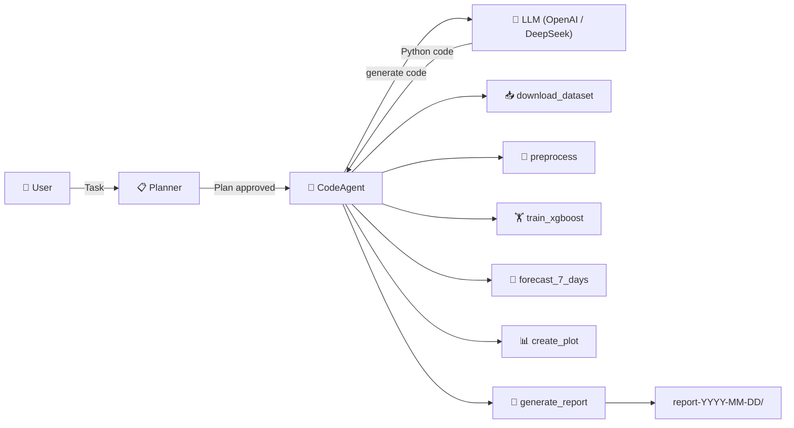
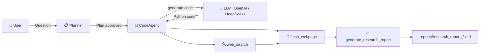

# `smolagent`

Simple agents built with [smolagents](https://github.com/huggingface/smolagents).

Two agents are included:

| Agent             | Script              | Purpose                                    |
|-------------------|---------------------|--------------------------------------------|
| **Forecast**      | `agent-forecast.py` | Time-series sales forecasting with XGBoost |
| **Deep Research** | `agent-deep.py`     | Web research & synthesis with citations    |

Both share a common set of utilities (`utils.py`) and tools (`tools.py`), and support OpenAI and DeepSeek backends via [LiteLLM](https://docs.litellm.ai/).

## Installation

**Requirements:**

- Python **3.10+**
- You'll need at least one of:
    - A [DeepSeek API key](https://platform.deepseek.com/api_keys)
    - An OpenAI-compatible API key (ask Frederik for the Labs key)

### Setup

```bash
# 1. Navigate into the project folder
cd smolagent

# 2. Create and activate a virtual environment
python -m venv .venv
source .venv/bin/activate

# 3. Install the project
pip install -e .
```

### Configuration

Create/edit `.env` in the project root:

```
DEEPSEEK_API_KEY=sk-your-actual-key-here
OPENAI_API_KEY=sk-your-actual-key-here
```

Only the key for the backend you intend to use is required.

## Architecture

```
smolagent/
├── pyproject.toml        # Project metadata & dependencies
├── agent-forecast.py     # Sales forecasting agent
├── agent-deep.py         # Deep research agent
├── tools.py              # All custom tools (both agents)
├── utils.py              # Shared utilities (env config, agent factory, callbacks, skill loader)
├── skills/               # Skill instruction manuals injected into the agent
│   ├── forecast/
│   │   └── SKILL.md      # Forecast pipeline guide
│   └── research/
│       └── SKILL.md      # Deep research pipeline guide
├── .env                  # API key configuration (not committed)
├── MEMORY.md             # Persistent agent memory across runs (not committed)
└── README.md             # Documentation (this file)
```

### Forecast Pipeline



### Deep Research Pipeline



## Tools

### Forecast Tools

| Tool                          | Purpose                                                     |
|-------------------------------|-------------------------------------------------------------|
| `download_dataset_from_hub`   | Fetch raw CSV from Hugging Face Hub                         |
| `preprocess_time_series_data` | Cap outliers, engineer lag/rolling/calendar features, scale |
| `train_xgboost_forecaster`    | Train XGBRegressor with 5-fold TimeSeriesSplit CV           |
| `forecast_next_7_days`        | Predict sales for the upcoming 7 days                       |
| `create_forecast_plot`        | Matplotlib charts: full history + zoom view                 |
| `generate_final_report`       | Bundle artifacts into `report-YYYY-MM-DD/` with `report.md` |

### Deep Research Tools

| Tool                       | Purpose                                                     |
|----------------------------|-------------------------------------------------------------|
| `web_search`               | Search the web via DuckDuckGo                               |
| `fetch_webpage`            | Fetch and extract full page content as Markdown             |
| `generate_research_report` | Synthesize findings into a structured report with citations |

### Shared Tools

| Tool            | Purpose                                                      |
|-----------------|--------------------------------------------------------------|
| `read_memory`   | Read the persistent `MEMORY.md` file                         |
| `update_memory` | Append learnings to `MEMORY.md` (auto-trimmed to 2500 chars) |

Both agents use a `MEMORY.md` file that persists across runs (max 2500 characters). The agent reads it at startup and writes learnings on completion. This helps the agent remember past decisions, errors, and patterns between sessions.

## Skills

Skills are **instruction manuals** written in Markdown that guide the agent through a domain-specific pipeline. They describe *what* each tool does, its parameters, and the recommended execution order — without duplicating the Python implementations (which live in `tools.py`).

A skill is loaded with `--skill <name>` and injected into the agent's system instructions. This gives the agent a structured mental model of the task without needing every detail in the user prompt.

### Available Skills

| Skill        | File                       | Purpose                                           |
|--------------|----------------------------|---------------------------------------------------|
| `forecast`   | `skills/forecast/SKILL.md` | End-to-end time-series sales forecasting guide    |
| `research`   | `skills/research/SKILL.md` | Deep research pipeline: search, fetch, synthesise |

### Using Skills

```bash
# Load the forecast skill (recommended for forecast tasks)
python agent-forecast.py --skill forecast --backend deepseek

# Load the research skill (recommended for research tasks)
python agent-deep.py --skill research --backend deepseek
```

When a skill loads, you'll see a confirmation:

```
📘 Skill 'forecast' loaded (4,827 chars, 217 lines)
```

> **Design note:** Skills and tools are separate concerns. Skills provide *knowledge* (what to do, in what order), while `tools.py` provides *capabilities* (the actual callable functions). Both are needed for the agent to work effectively.

## Usage

### Forecast Agent

```bash
source .venv/bin/activate

# Default: forecast chocolate sales with OpenAI
python agent-forecast.py

# Use DeepSeek backend
python agent-forecast.py --backend deepseek

# Skip planning (go straight to execution)
python agent-forecast.py --no-plan

# Custom task
python agent-forecast.py "Download AiresPucrs/time-series-data, train a model, and forecast 7 days."

# Load the forecast skill for pipeline guidance
python agent-forecast.py --skill forecast --backend deepseek

# Increase per-step timeout for slow training runs
python agent-forecast.py --timeout 180
```

The forecast agent will:
1. **Plan** — creates a plan (you approve it before execution)
2. **Download** — fetches `AiresPucrs/time-series-data` from the Hub
3. **Preprocess** — caps outliers, engineers time/lag/rolling features, one-hot encodes, standard-scales
4. **Train** — fits an XGBRegressor with 5-fold TimeSeriesSplit CV
5. **Forecast** — predicts the next 7 days of sales
6. **Plot** — saves full-history and zoomed-in forecast plots
7. **Report** — bundles everything into `report-YYYY-MM-DD/` with a `report.md`

### Deep Research Agent

```bash
source .venv/bin/activate

# Default topic
python agent-deep.py

# Custom research question
python agent-deep.py "What are the latest advances in photonic computing?"

# Use DeepSeek backend
python agent-deep.py --backend deepseek "Compare RAG vs long-context models"

# Skip planning
python agent-deep.py --no-plan "Current state of carbon-capture technology"

# More steps for thorough research
python agent-deep.py --max-steps 25 "How is CRISPR used in agricultural biotech?"

# Load the research skill for pipeline guidance
python agent-deep.py --skill research --backend deepseek

# Increase per-step timeout for slow page fetches
python agent-deep.py --timeout 60
```

The deep research agent will:
1. **Plan** — breaks the question into search subtasks
2. **Search** — queries DuckDuckGo for relevant sources
3. **Fetch** — retrieves full page content from the most promising results
4. **Synthesize** — cross-references sources and produces a structured report
5. **Report** — saves a dated Markdown report with key findings, citations, and methodology

### Common Options

| Flag                    | Description                                           | Default                    |
|-------------------------|-------------------------------------------------------|----------------------------|
| `--backend`             | LLM backend (`openai` or `deepseek`)                  | `openai`                   |
| `--no-plan`             | Skip the planning step                                | off                        |
| `--max-steps N`         | Max agent steps                                       | 15 (forecast) / 20 (deep)  |
| `--planning-interval N` | Re-plan every N steps                                 | 1000 (plan only on step 1) |
| `--skill NAME`          | Load a skill manual from `skills/<NAME>/SKILL.md`     | none                       |
| `--timeout N`           | Max seconds per tool execution step (0 = no limit)    | 120                        |

