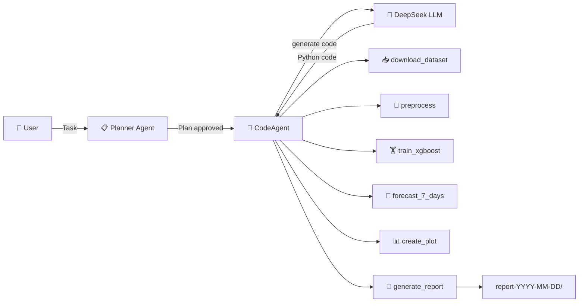

# `smolagents-forecaster`

A simple agent built with [smolagents](https://github.com/huggingface/smolagents).

## Architecture

```
smolagents-forecaster/
├── pyproject.toml    # Project metadata & dependencies
├── agent.py          # Main agent script
├── tools.py          # Custom tools for the agent
├── .env              # API key configuration (not committed)
└── README.md         # Documentation (this file)
```



### Available Tools

| Tool                          | Purpose                                                    |
|-------------------------------|------------------------------------------------------------|
| `download_dataset_from_hub`   | Fetch raw CSV from Hugging Face Hub                        |
| `preprocess_time_series_data` | Clean outliers, engineer features, scale                   |
| `train_xgboost_forecaster`    | Train XGBoost with TimeSeriesSplit CV                      |
| `forecast_next_7_days`        | Predict sales for the upcoming week                        |
| `create_forecast_plot`        | Plotly chart: history + forecast                           |
| `generate_final_report`       | Collect artifacts -> `report-YYYY-MM-DD/` with `report.md` |

## Installation

You will need:

- Python **3.10+**
- A [DeepSeek API key](https://platform.deepseek.com/api_keys)

Then, clone the repository and install the dependencies:

```bash
# 1. Clone or navigate into the project folder
cd smolagents-forecaster

# 2. Create and activate a virtual environment (recommended)
python -m venv .venv
source .venv/bin/activate 

# 3. Install the project
pip install -e .
```

### Configuration

You will need to edit/create the `.env` file inside the project root and add your DeepSeek API key:

```
DEEPSEEK_API_KEY=sk-your-actual-key-here
```

Get your key at [platform.deepseek.com/api_keys](https://platform.deepseek.com/api_keys).

## Usage

```bash
# Make sure your virtual environment is activated
source .venv/bin/activate

# Run the agent
python agent.py
```

The agent will:
1. **Plan**: creates a TODO list (you approve it before execution)
2. **Download**: fetches `AiresPucrs/time-series-data` from the Hub
3. **Preprocess**: caps outliers, engineers time features, scales numerically
4. **Train**: fits an XGBRegressor with 4-fold TimeSeriesSplit CV
5. **Forecast**: predicts sales for the next 7 days
6. **Plot**: saves forecast plots (full history + zoom view)
7. **Report**: bundles everything into `report-YYYY-MM-DD/` with a `report.md`

